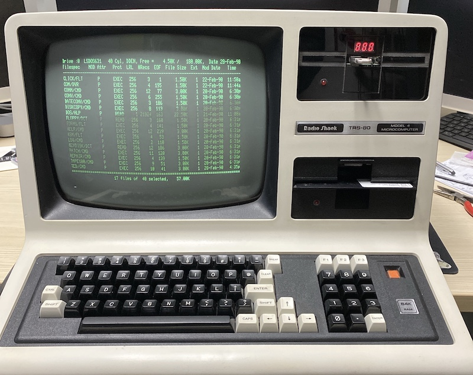

# TRS80gotek
## Configuring a TRS-80 Model 4 to boot from a GoTek floppy emulator to FreHD system

The [TRS-80 Model 4 computers](https://en.wikipedia.org/wiki/TRS-80_Model_4) are a family of systems from 1983, built and sold by Tandy/Radio Shack. They consist of a monitor, keyboard and floppy drives in one case with a very traditional "retro computer look", and continue to be popular with enthusiasts. They are Z80 based, with up to 128Kb of RAM. They run propritary disk operating systems but also CP/M. Today they are used mostly for nostalgic reasons.

## Adding a GoTek to the TRS-80 Model 4

A [GoTek](http://www.gotekemulator.com) is a piece of hardware designed to physicaly fill the space that would have been taken by a 3.5 inch floppy disk drive. It consists of a unit that accepts USB flash drives, a three digit LED display and two buttons (many users augment or replace these controls with OLED panels and rotary controls). The GoTek was created to replace floppy disk drives in equipment such as musical instruments and industrial control hardware - but they have proved very popular with retro computer user, as they can be used to replace drives in systems from Amigas to TI-99/4As with convenient USB drives. The GoTek hardware can be found on eBay and Amazon for $20 or less. There are several variations, and before you buy one you should [read the links on this page](http://www.github.com/keirf/FlashFloppy/wiki/Gotek-Compatibility) to make sure to you're buying one that is compatible.

1. Changing the firmware

In order to use the GoTek you will first need to change the firmware to a new version called [FlashFloppy](https://github.com/keirf/FlashFloppy).

1.1 Download the latest firmware from the [FlashFloppy](https://github.com/keirf/FlashFloppy) Github site.

1.2 Set appropriate jumpers on the GoTek. I soldered in some pins to make this easier.

1.3 Connect the GoTek to your computer using a USB-A to USB-A lead (a little unusual, but eBay to the rescue). [Here's a good set of instructions](http://www.binarydevotion.com/?p=228).

1.4  Run the flash utility from [ST Microelectronics](http://www.st.com/content/st_com/en/products/development-tools/software-development-tools/stm32-software-development-tools/stm32-programmers/stsw-stm32080.html) and upload the firmware to the GoTek. There are some more intructions in this [video](https://www.youtube.com/watch?v=-K31S2xqZIk&feature=youtu.be&t=841).

1.5 Make a dontation to the FlashFloppy author.

This copy of [TRS8Bit](http://www.fabsitesuk.com/tandy/trs8bit_year13.pdf) magazine has an excellent article covering all this in detail with with more authority than here.

2. Housing the GoTek

I removed the GoTek from the original casing, and installed it into a laser-cut acrylic enclosure the same size as an original floppy drive. The plans I used to make my enclosure are included with the other files in this repo as **FloppyDrivemk5.pdf**. I used 3mm thick black acrylic cut on a GlowForge. The exact spacings for mounting hole etc. matched the GoTek model I had, using 10mm spacers to lift it up off the base and line up the USB and buttons. I added a 5mm LED connected to the pins used by the existing LED on the GoTek. The smaller rectangular hole was for the 3 digital LED, the larger for the USB key and buttons. You may need to adapt for your specific model of GoTek and if you are using an OLED screen. 

3. Getting the right cabling

You will need to tap 5v from inside the TRS-80 to connect to the power connector on the GoTek. However, the trickier part is building or buying the right floppy disk cable. The original TRS-80 drives have an edge connector, the GoTek a more modern (ish!) pin and socket connection. I obtained the right cable from Jay at [NewSoft](http://plaidvest.com/newsoft/). You will need to decide if you want the GoTek to be drive 0 or 1 as this is set in the cable. I wanted it to be drive 0 so I could boot from it. There's no reason why you couldn't connect two GoTeks.

4. Setting the correct jumpers

Make sure to set the [GoTek jumpers](https://torlus.com/floppy/forum/viewtopic.php?t=3171) to match your drive selection choice. As the drive select is done through the cable, no matter how many GoTeks are used, they all would be set to same, lowest Drive Select option (I think).

5. Obtaining a disk image

Now format a USB stick to MS-DOS/FAT32 and put a TRS-80 bootable image on it. You can create a disk image in .hfe format using a piece of software called the [HxCFloppyEmulator](hxc2001.free.fr/floppy_drive_emulator/index.html). An example image that worked for me to boot up the FreHD is included in this repo called **UnzipIntoUSBRoot.zip** - which you should unzip into a freshly formatted USB drive. If you aren't using FreHD, you should use HxCFloppyEmulator to create your own custom drive. You can have multiple .hfe images on the same USB drive: you select the one you want with the buttons on the GoTek and the LED display lets you know which one is currently selected.

## Using the GoTek with a FreHD hard drive emulator

My TRS-80 Model 4 had only one good floppy, so my goal was to boot from the GoTek and then mount the [FreHD](http://members.iinet.net.au/~ianmav/trs80/emulator.htm) hard drive emulator. So you need two things: 

1. The files for the USB drive that is in the GoTek. This consists of a .hfe file on the USB drive containing the frehd autoboot loader on the boot sector of the "floppy". At least, that's what Matt from the [TRS-80 facebook group](https://www.facebook.com/groups/331822553911105/?multi_permalinks=859479207812101&notif_id=1582732527634985&notif_t=feedback_reaction_generic) told me :) and he let me put his file into the repo as **frehdboot.hfe**. Download that to your USB stick. You'll also need the support files that tell the GoTek what kind of drive it is emulating. You can read the details behind Matt's work in the file **readme-frehd-boot.txt** and associated file **loader2.zip**.

2. The files for the FreHD SD Card. These are the standard files for the Model 4 that come on the CD-ROM supplied with the FreHD, with one change: you will need to add the FreHD.rom file to the root of the SD card or it won't boot - you'll see one blink of the green FreHD LED and then nothing will happen.

Note: This process should work for the TRS-80 Model III.
